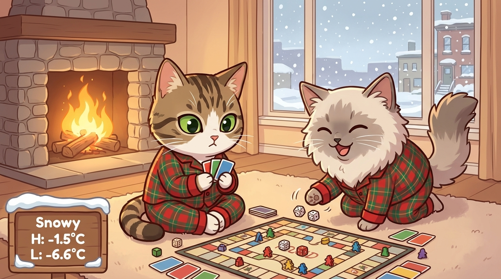

_Forecats is a Home Assistant integration that takes pictures of your cat(s) and forecast data, and then uses Gemini's Nano Banana image generation model to create and weather-themed pictures of your cats. I display these pictures on a Spectra 6 e-ink screen_

_The actual implementation (and steps to do it yourself) of this project can be found in [this](https://github.com/jwardbond/jwardbond.github.io) github repo._

---

Last week, during a fit of manic procrastination, I set up a Home Assistant (HA) server on an unused RPI3. It was surprisingly easy. My mind was quickly awash with automation ideas: a laundry timer? a medication tracker? A kibble defense system to prevent my pig-racoon of a cat from eating his younger brother's kibbles?

My wife was less enthusiastic about the possibilities. She couldn't see the potential. As far as she was concerned, the only difference in our pre- and post-HA lives was that the "weird electric box thingy" in the cat litter closet was now plugged in to the router behind the couch.

And so, to impress my wife, I came up with Forecats; Using the HA server to generate daily pictures of our cats enjoying whatever weather is in the the forecast for the day, and serving this generated picture to an e-ink screen every morning. It didn't work. Or rather, it _worked_ but it didn't impress her. Tough crowd.[^1] I impressed myself though, and learned a heck of a lot in doing it:

## Materials

- [reTerminal E1002 Full-colour ePaper Display](https://www.seeedstudio.com/reTerminal-E1002-p-6533.html). This is a colour e-ink display that combines a Spectra 6 display with an ESP32-S3 board
- A raspberry PI running Home Assistant

## Home Assistant Integration

The image generation procedure is implemented as a custom HA integration. Doing all this extra setup just to call a `generate_cat_pictures` function in python still feels a little overcomplicated to me, but this is the best way I could find to a) run custom python code with 3rd party libraries and b) handle the fact that the LLM API calls take a few seconds. This integration exposes the image generation function as an HA service which can then easily be called as part of an automation.

## Image generation

`generate_cat_pictures` is the main entry point for image generation. You can see all the inputs [here](https://github.com/jwardbond/forecats/blob/ha_integration/models.py) but the important ones are:

- The forecast data from [HA's weather integration](https://www.home-assistant.io/integrations/weather/)
- Images + text descriptions of my cats
- A list of possible art styles
- Output details (image size, colour profile, post-processing, etc.)

I got really lucky when doing this project because google had _just_ released `gemini-3-pro-image-preview`, and I hadn't realized how few image-to-image APIs were available prior to this.

I had some problems with the outputs looking same-y --- which I think is mostly a result of how good image generation models are getting at following prompts --- so I did a few things to keep the outputs looking _fresh_. The most impactful of these was using a two-stage image generation process. First, a scene generation model (`gemini-2.5-flash-lite`) uses forecast data to generate a description like:

```
Activity: Cozy Board Game Marathon, Foreground: Two cats in matching pajamas playing a complex board game with tiny dice and colourful cards, Background: A warm, inviting living room in Toronto with a fireplace and a window showing a gentle snowfall.
```

Then, the image generation model (`gemini-3-pro-image-preview`), takes this scene descrition, the forecast data (again), pictures/descriptions of my cats, and a randomly selected art style to output an image like:



I do a couple other things to vary the outputs, mostly prompt engineering. You can find the full prompts [here](https://github.com/jwardbond/forecats/blob/e9b00c71dbacdcc5a1384c3a4826f6e1c84d5d55/forecats.py#L109). The only other note-worthy trick is keeping a cache of the most recent 20 scene discriptions, and instructing the scene-generation model not to repeat any of those activities.

## Image post-processing

The e-ink device I use to display the images has a Spectra 6 screen. This screen has a resolution of 800x480 (5:3) and each pixel can display six possible colours (white, black, red, blue, green, yellow). Images therefore need to be cropped to the correct size, and recoloured/quantized to use only the allowable colours.

Because of the very limited palette, I use dithering to approximate the other colours.[^2] I used [Floyd-Steinberg dithering](https://en.wikipedia.org/wiki/Floyd%E2%80%93Steinberg_dithering) --- mostly it was the only dithering algorithm in the [Pillow](https://pypi.org/project/pillow/) library and I didn't want to go hunting around. It ended up working pretty well, but it's on my todo list to try out some other error diffusion techniques, and to try it with HSL values instead of RBG.

The actual colours on Spectra 6 screens don't _quite_ match the reference colours from the specs. For instance, although the documentation says it displays #00ff00, the colour that is actually displayed is something much less intense, like #608050. To minimize the difference between the displayed image and the generated image, I dither with the actual colour palette and then convert back to the reference pallete before displaying.[^3]


## E-ink display

You can find the [ESPHome](https://esphome.io/) config I use to control the e-ink display [TODO](). It's nothing special. The display sleeps until the time the image is generated, then wakes, downloads the image from the `www/` directory on the HA server, and goes back into deep sleep until the next morning. I also added some manual wake-up/download/sleep functionality for testing.

Simple enough, but it took an embarassingly long time to set up. Largely because I was working on it in a fugue state between 00:00 and 03:00, and I thought I bricked my device because I didn't program any functionality other than "download image at 05:00", so I was sitting there pressing the buttons, and nothing was happening. I even ordered a new one before I realized I should probably add some testing functionality... it was working the whole time. I probably flashed it 100 times before this point.

It wasn't all my fault though. The ESPHome add-on in HA took such an impossibly long time to compile config files that I ended up doing it all from the CLI on my local computer. I was also never able to get logs working through a serial port (although they did work over MQTT).

I ran into an interesting challenge a couple days in, when I woke up and saw that the image hadn't updated. The device was set to download the image as soon as it turned on, but when I looked at my HA logs I saw that the device had turned on and connected to my HA server almost 10 minutes earlier than expected. Turns out the RTC clock used for timing deep sleep (among other things) on ESP32-S3 devices has a ton of drift (in my case almost 30 seconds per hour) which was causing the device to wake up before the new image had been generated. I have seen people model the drift on their devices and then use that to correct the clock, but I went for a simpler approach: I made the device wake up 10 minutes before the image is created, get the actual time from the HA server, and then wait until after the image has been generated to download and sleep.

## Final thoughts

I'm not good at finishing projects. I'm often not even good at starting them. I commonly set the bar too high, and get bored halfway through. For this project I told myself "Just get it done as fast a possible, and you can perfect it later", which seems to have worked: although this project is not _quite_ where I want it to be, and although this blog post is not as polished as I dreamed it would be, the whole thing feels waaaay more complete than most of my projects. I am excited to try this philisophy out in other parts of my life (like my research).

I had this weird moment at the end of this project, when I finally saw that first, grainy cartoon of my kitties. I was so immensely proud of what I had done, but then I started sharing it with my friends and the reaction felt underwhelming, along the lines of "oh haha, thats pretty neat". In my mind I had just built something monumental --- that little screen was the culmination of so much new knowledge and hard work --- but in my Wife's mind I had just went on a three-day bender building a worse version of the automated photo album that our chromecast puts on our TV. I normally feel the _other_ way about my projects: I see all the flaws and assumptions and hacks that went into what I built, and end up with a lower opinion of my work than other people seem to have. I am not sure what caused me to feel different about this project, and I am curious to see if this observation holds as I (try to) share this project with a wider audience!

[^1]: I'm just being silly here.
[^2]: Fill in
[^3]: I'd seen the word "dithering" a bunch of times in various Hacker News threads, but for the life of me I could not figure out why so many people found it interesting. Jokes on me because this was definitely the most fun part of the code.
[^4]: It is my understanding that the displayed image will be more faithful to the original image if the dithering is done with the actual, percieved colours, and then converted to the reference colours before displaying. I don't have a way to measure the actual colours of the display, so I just use the Sepctra 6 colour map from Robert Gühne's [epdoptimize library](https://github.com/Utzel-Butzel/epdoptimize/blob/2c0cbb8ad72ce9fad6337c94d0557cb7651a2883/src/dither/data/default-palettes.json) to convert between actual and reference colours. I am not sure how these colors were generated, because upon [closer inspection](https://coolors.co/191e21-e8e8e8-2157ba-125f20-b21318-efde44), they also don't seem to match the actual colours on spectra 6 displays... they work though! I will update this section if/when the author of the repo gets back to me.
